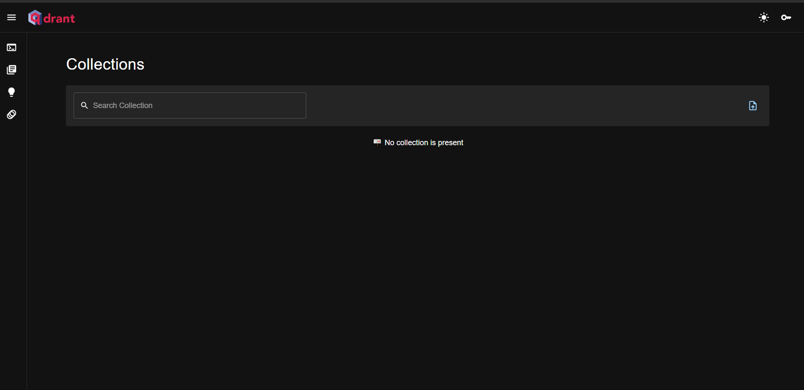
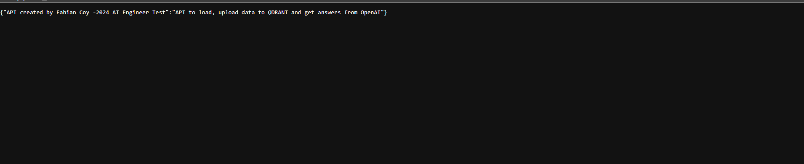
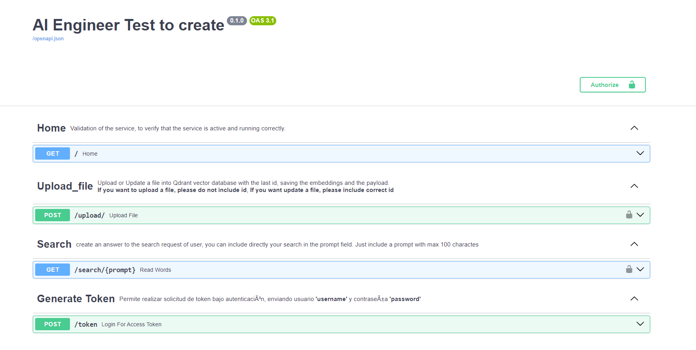
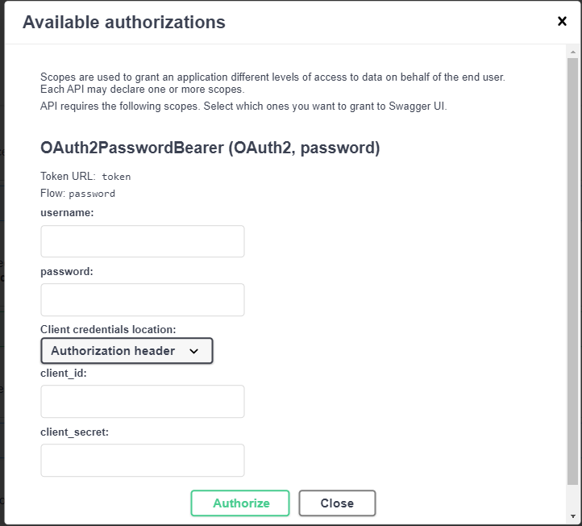
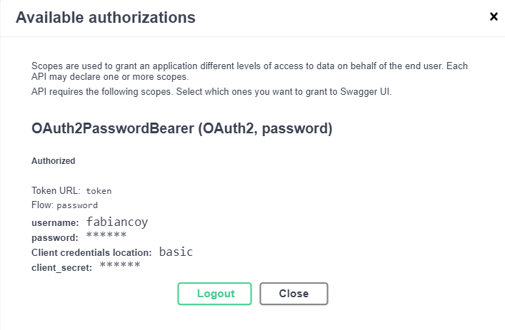
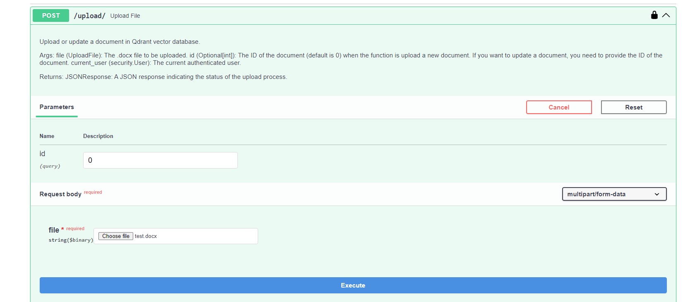
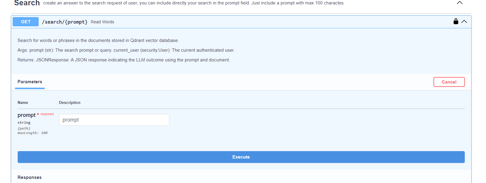

# AI_Engineer_Test_Django

## Project Description

This project aims to develop a backend application that provides two main functionalities through REST endpoints.

## Functionality 1: Document Processing and Storage (.docx)

Develop an endpoint that allows the upload of .docx documents. Utilize the OpenAI API to process these documents and generate vector embeddings of the textual content. Store these embeddings in a vector database.

## Functionality 2: Information Retrieval and Search

Implement an endpoint that enables text search in the vector database. Retrieve the most relevant documents based on the similarity of their embeddings. Use these documents to respond to user queries or questions sent to the endpoint.

## Development

The development of this project involves implementing an API with the two main functionalities described in the project description. The API should provide endpoints for document processing and storage, as well as information retrieval and search.

To ensure security, the API is developed using FastAPI, which includes built-in security features. These features can be configured to authenticate and authorize users accessing the API endpoints.

During development, it is recommended to run the API on a local machine for testing and debugging purposes. You will be able to run locally the API and make some changes to adapt in your environment and use it successfully. 

For production deployment, it is recommended to use Docker file or the  Docker Compose file located in this repository. Docker compose file allows for containerization of the API and Qdrant, the vector database used for storing the embeddings. If you run the Docker Compose, you must guarantee that the vector database is able to be connected with other components.

To deploy the project in production, you can create a Docker Compose file that includes the necessary configurations for the API and Qdrant. This file can be used to spin up the containers and ensure that the solution runs correctly in a production environment.

Please note that the above description provides a high-level overview of the development and deployment process. Further details and specific implementation steps may be required based on the project requirements and infrastructure setup.


## Main Resources Used

- Qdrant: A vector database used for storing the embeddings.
- FastAPI: A framework used for building the API.
- OpenAI API: Used for generating vector embeddings of the document content.
- Langchain: A framework used to connect a Language Model (LLM) for processing text and producing accurate answers.

## Qdrant Installation

To install Qdrant, follow these steps:

1. Download the official Qdrant image from [https://qdrant.tech/documentation/quick-start/](https://qdrant.tech/documentation/quick-start/).
2. Run the following command to pull the image:
        ```
        docker pull qdrant/qdrant
        ```
3. Start the container using the following command:
        ```
        docker run -p 6333:6333 -p 6334:6334 qdrant/qdrant
        ```

Please note that the above steps assume you have Docker installed on your system.

When you guarantee and proof that Qdrant is running correctly, you will be able to access to the next url http://127.0.0.1:6333/dashboard and manipulate Qdrant tool and explore its functionalities. 

The next image show the correct deployment is running:



## Deploy API

To deploy the API, follow these steps:

1. Create your own environment in your local machine.
2. Install the requirements located in the `requirements.txt` file using the following command:
        ```
        pip install -r requirements.txt
        ```
3. Create a `config.yaml` file that includes all the credentials to be connected with all components. The structure and type of the variables should be as follows:

        ```yaml
        openai:
            key: string
            model: string
            tokenizer: string
            llm_model: string
        qdrant:
            host: string
            port: int
            collection: string
            size_embeddings: int
        llm:
            threshold: int
            prompt_template: string
        secure:
            SECRET_KEY: string
            ALGORITHM: string
            ACCESS_TOKEN_EXPIRE_MINUTES: int
            PASSWORD: string
        api:
            max_length_prompt: int
        ```

4. Make sure to replace the `string` and `int` values with the actual credentials and configuration values.

The `config.yaml` file is structured into five sections:

1- OPENAI: In this section, you are required to create an API key using your personal or organizational account on the OpenAI platform. Additionally, you must specify the model responsible for generating embeddings, the tokenizer used for token counting in your text, and the LLM (Language Model) model integrated with the Langchain framework, which will generate the desired outcomes.

2- Qdrant: This section configures the vector database, Qdrant. Here, you define the host and port where Qdrant is running. The parameter collection specifies the name under which documents will be saved. If the collection does not exist, the script can automatically create it. The size_embeddings parameter determines the dimensionality of the embeddings, which can significantly enhance user searches and organize text logically.

3- LLM: In this segment, you set the parameters for the Language Model (LLM). The threshold parameter establishes a limit based on the similarity between search queries and documents. If the similarity falls below this threshold, the system will return a message indicating that the indexed data does not match the search. The prompt_template defines the instruction for the LLM model's operation. You can customize this instruction by specifying the tone, role, and structure to formulate an appropriate response.

4- SECURE: This section is dedicated to configuring the security module. The SECRET_KEY parameter is used for authenticating the primary user to generate other hashed passwords. ALGORITHM specifies the type of hashing algorithm employed. ACCESS_TOKEN_EXPIRE_MINUTES determines the duration, in minutes, for which a logged-in user can utilize the API. Lastly, PASSWORD is a parameter used for accessing the unsecured module.

5- api: This section includes parameters related to the API. max_length_prompt_int sets the maximum number of characters to be inserted in the user prompt.

Once the environment is set up and the credentials are configured, you can deploy the API using the appropriate deployment method, such as running in local,  Docker Compose or any other deployment tool of your choice.

# Create a User 
Before to run the API follow the next steps:

"To create a user, follow these steps:"

1-Locate the script named create_user.py within the lib directory of the repository.

2-Run the script by executing it with your preferred Python interpreter.

3-Follow the instructions provided by the script. You will be prompted to enter a username and password.

4-Remember the username and password you've entered, as they will be required when interacting with the deployed API.

# Start API locally

To deploy an API using FastAPI, follow these steps:

To run your FastAPI application, execute the following command in your terminal:

        ```
        uvicorn main:app --host 0.0.0.0 --port 8000
        ```

- `main:app` specifies the location of your FastAPI application.
- `--host 0.0.0.0` ensures that the server is accessible from external devices.
- `--port 8000` specifies the port number on which the API will run. Change this port number if necessary.

**Access Your API:**
Once the API is running, you can access it using the following URL in your web browser or API client:

    ```
    https://localhost:8000
    ```

Replace localhost with the appropriate hostname or IP address if the server is hosted elsewhere.

**Interact with Endpoints:**
With the API running, you can now interact with its endpoints using HTTP requests. Use tools like cURL, Postman, or your preferred programming language's HTTP library to send requests and receive responses.

Stop the Server:
To stop the API server, you can press **Ctrl + C** in the terminal where it's running. This will gracefully shut down the server.

When you have your API running correctly will have the next outcome in your browser: 



# Interaction and check functionality
Once the API is running, you can easily interact with it by accessing the Swagger documentation. Open your web browser and navigate to:

    ```
    https://localhost:8000/docs
    ```

This interactive documentation provides a user-friendly interface to explore and test the API's functionalities.

Functionalities:
The API offers the following functionalities:

-**Home:** A GET response endpoint to check the functionality of the API.
-**Upload File:** A POST response endpoint responsible for uploading a new file or updating a document by adding the respective document ID.
-**Search:** A GET response endpoint designed to provide answers based on user searches.
-**Generate Token:** A POST response endpoint used to create a respective token by inserting a username and password.

With the API running and the documentation open, you can easily interact with each endpoint by clicking on them and providing the required parameters. Use the provided examples to understand the expected input and output formats.

Next image represent the visualization API documentation



Before utilizing the Upload File or Search functionalities, authentication within the API is required. This occurs when you input your respective credentials in the authentication option, situated in the upper-right corner of the screen, highlighted in green. The subsequent image illustrates how the new screen appears when accessed.



Once you possess the correct credentials and have obtained a token, you will be directed to the following screen, as depicted in the accompanying image.



To engage with the Upload File option, click on the `Try Out` button. Subsequently, you will encounter two fields. The first one is the ID field, which is optional. By default, it is set to 0. However, if you input a different number, it signifies an update to the document. If the provided ID value does not exist in the database, the API response will display `Invalid ID. The last ID is {last ID value in Qdrant}`. The second field allows you to upload a file to Qdrant. If the file has a different extension other than .docx, the API will respond with `Invalid file type. Please upload a .docx file`.

For enhanced clarity and streamlined interaction with other systems, the API provides detailed explanations of the processes involved in the upload or update procedures. The interface displayed in the following image illustrates these two fields available for interaction.



To utilize the Search option, begin by selecting the `Try Out` button. Subsequently, you can input your desired text into the prompt field, which corresponds to the user's search query. Afterward, click on `Execute`, and the API will provide a response message. However, if the question or prompt fails to meet the similarity score criteria, the API will respond with: `I don't have any data matching a document according to your search.`

The next image represents the visualization of Search




Once you have verified the proper functionality of the API and ensured successful document updates in the Qdrant vector database, you can proceed to run your project using Docker Compose. This allows for the creation of multiple containers, with one designated for the API and another for the pre-downloaded Qdrant image.

To deploy the project, execute the following terminal command:

    ```
    docker-compose up -d
    ```
This command initiates the deployment in detached mode, allowing the containers to operate independently in the background.

Ensure that the configuration settings in your Docker Compose file enable Qdrant to establish connections with other containers as required. This facilitates seamless interaction between components within your infrastructure.

# Next Improvements 
This marks the initial step in crafting your own RAG (Retriever, Answer Generator) tailored to your unique set of documents. However, it's imperative to conduct various experiments with diverse file types, altering their lengths to ascertain the efficacy of search functionalities when generating embeddings based on specific sizes. At times, optimal practices involve exploring alternative approaches, such as modifying chunk sizes for storage in the vector database. Additionally, consider employing an unsupervised machine learning model to preprocess the inception of your documents and generate labels, streamlining the process for the Language Model (LLM) while enhancing the provision of comprehensive information.
